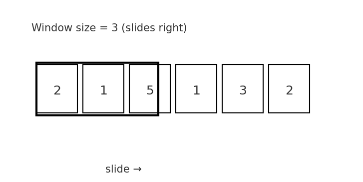
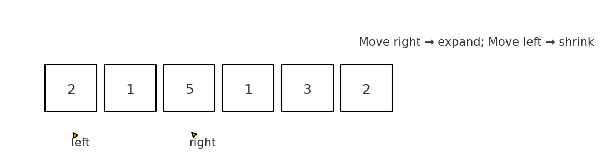

# 🪟 Sliding Window Cheatsheet (Java 17)

> A complete reference for interviews and real-world Java use  
> *(Optimized for Light-mode GitHub Wiki — code blocks are syntax-highlighted)*

---

## 🌱 1. What Is a Sliding Window?

A **sliding window** is a sub-range of elements that “slides” across an array or string.  
It helps optimize brute-force `O(n²)` algorithms to `O(n)` by reusing partial results.

---

## 🧩 2. Two Main Variations

| Type | Description | Typical Use |
|------|--------------|-------------|
| **Fixed Window** | Window size is constant | Average, max sum of size k |
| **Dynamic Window** | Window expands/contracts | Longest substring, min length subarray |

---

## 🪟 3. Fixed-Size Window — `O(n)` - Template #1

```java
// code/file: code/FixedWindow.java
public class FixedSlidingWindow {
    public static void main(String[] args) {
        int[] arr = {2, 1, 5, 1, 3, 2};
        int k = 3;

        int windowSum = 0, maxSum = 0;

        // sum of first window
        for (int i = 0; i < k; i++) {
            windowSum += arr[i];
        }

        maxSum = windowSum;

        // slide window
        for (int end = k; end < arr.length; end++) {
            windowSum += arr[end] - arr[end - k]; // add new, remove old
            maxSum = Math.max(maxSum, windowSum);
        }

        System.out.println("Max sum of " + k + " consecutive = " + maxSum);
    }
}
```

---

## ⚡ 4. Dynamic-Size Window (Expanding + Contracting) - Template #2

```java
 /**
     * Find length of longest substring without repeating characters
     * Input: "abcabcbb" -> Output: 3 ("abc")
     */
    public int lengthOfLongestSubstring(String s) {
        if (s == null || s.length() == 0) {
            return 0;
        }

        // Map to store the last seen index of each character
        Map<Character, Integer> charIndexMap = new HashMap<>();
        int maxLength = 0;
        // Left pointer of the sliding window
        int windowStart = 0;

        // Iterate through the string with the right pointer
        for (int windowEnd = 0; windowEnd < s.length(); windowEnd++) {
            char rightChar = s.charAt(windowEnd);

            // If the character is already in the map, move the windowStart past the last occurrence
            if (charIndexMap.containsKey(rightChar)) {
                // Use Math.max to ensure windowStart only moves forward,
                // in case the repeating character's last index is outside the current window
                windowStart = Math.max(windowStart, charIndexMap.get(rightChar) + 1);
            }

            // Update the character's last seen index
            charIndexMap.put(rightChar, windowEnd);

            // Update the maximum length found so far
            // Current window size is windowEnd - windowStart + 1
            maxLength = Math.max(maxLength, windowEnd - windowStart + 1);
        }

        return maxLength;
    }

    public static void main(String[] args) {
        DynamicWindow solution = new DynamicWindow();
        String input = "abcabcbb";
        int length = solution.lengthOfLongestSubstring(input);
        System.out.println("Input: \"" + input + "\"");
        System.out.println("Output: " + length); // Expected output: 3
    }
}
```

---

## 💧 5.1 Variation — Minimum Window Substring - Template #3

```java
// code/file: code/MinWindow.java
/**
 * Find smallest substring in s that contains all chars of t
 * s = "ADOBECODEBANC", t = "ABC" -> "BANC"
 */
import java.util.*;

public class MinWindow {
    public static String minWindow(String s, String t) {
        if (s.length() < t.length()) return "";
        Map<Character, Integer> freq = new HashMap<>();
        for (char c : t.toCharArray()) freq.put(c, freq.getOrDefault(c, 0) + 1);

        int left = 0, right = 0, required = t.length();
        int minLen = Integer.MAX_VALUE, start = 0;

        while (right < s.length()) {
            char c = s.charAt(right++);
            if (freq.containsKey(c) && freq.put(c, freq.get(c) - 1) > 0) required--;

            while (required == 0) {
                if (right - left < minLen) {
                    minLen = right - left;
                    start = left;
                }
                char lc = s.charAt(left++);
                if (freq.containsKey(lc) && freq.put(lc, freq.get(lc) + 1) > 0)
                    required++;
            }
        }
        return minLen == Integer.MAX_VALUE ? "" : s.substring(start, start + minLen);
    }

    public static void main(String[] args) {
        System.out.println(minWindow("ADOBECODEBANC", "ABC")); // BANC
    }
}
```

```java
public class MinSubArraySum {
    public static void main(String[] args) {
        int[] arr = {2, 1, 5, 2, 3, 2};
        int target = 7;

        int left = 0, windowSum = 0;
        int minLength = Integer.MAX_VALUE;

        for (int right = 0; right < arr.length; right++) {
            windowSum += arr[right];

            while (windowSum >= target) {
                minLength = Math.min(minLength, right - left + 1);
                windowSum -= arr[left++];
            }
        }

        System.out.println("Smallest subarray length: " + minLength);
    }
}
```
---
## 🧮 5.2 Variation — Longest Substring with K Distinct Characters - KDistinct pattern
```java
import java.util.*;

public class KDistinct {
    public static void main(String[] args) {
        String s = "araaci";
        int k = 2;

        Map<Character, Integer> freq = new HashMap<>();
        int left = 0, maxLen = 0;

        for (int right = 0; right < s.length(); right++) {
            freq.put(s.charAt(right), freq.getOrDefault(s.charAt(right), 0) + 1);

            while (freq.size() > k) {
                char leftChar = s.charAt(left++);
                freq.put(leftChar, freq.get(leftChar) - 1);
                if (freq.get(leftChar) == 0) freq.remove(leftChar);
            }

            maxLen = Math.max(maxLen, right - left + 1);
        }

        System.out.println("Longest substring with " + k + " distinct chars = " + maxLen);
    }
}

```
---
## 📈  5.3 Variation — Maximum of Each Sliding Window (Deque Method) - Advanced pattern
```java
import java.util.*;

public class SlidingWindowMax {
    public static int[] maxSlidingWindow(int[] nums, int k) {
        Deque<Integer> dq = new ArrayDeque<>();
        int[] res = new int[nums.length - k + 1];
        int idx = 0;

        for (int i = 0; i < nums.length; i++) {
            while (!dq.isEmpty() && dq.peekFirst() <= i - k)
                dq.pollFirst();

            while (!dq.isEmpty() && nums[dq.peekLast()] < nums[i])
                dq.pollLast();

            dq.offerLast(i);

            if (i >= k - 1)
                res[idx++] = nums[dq.peekFirst()];
        }
        return res;
    }

    public static void main(String[] args) {
        int[] arr = {1, 3, -1, -3, 5, 3, 6, 7};
        System.out.println(Arrays.toString(maxSlidingWindow(arr, 3)));
    }
}

```
---
## 📈  5.4 Variation — Maximum of Each Sliding Window (Monotonic Method) - Advanced pattern
```java
import java.util.*;

public class SlidingWindowMax {
    public static int[] maxSlidingWindow(int[] nums, int k) {
        Deque<Integer> dq = new ArrayDeque<>();
        int[] res = new int[nums.length - k + 1];
        int idx = 0;

        for (int i = 0; i < nums.length; i++) {
            while (!dq.isEmpty() && dq.peekFirst() <= i - k)
                dq.pollFirst();
            while (!dq.isEmpty() && nums[dq.peekLast()] < nums[i])
                dq.pollLast();

            dq.offerLast(i);

            if (i >= k - 1)
                res[idx++] = nums[dq.peekFirst()];
        }
        return res;
    }
}

```
---

## 🧮 6. Pattern Recognition Table

| Pattern | Expands When | Shrinks When | Tracks |
|----------|--------------|---------------|---------|
| Fixed-size average | Always | Every step | Sum / mean |
| No repeat substring | Not duplicate | Duplicate appears | Set / Map |
| Min window substring | Missing required chars | All chars present | Map count |
| Longest K distinct | ≤ K distinct | > K distinct | Map size |
| Target sum subarray | Sum < target | Sum ≥ target | Sum |

| Question Mentions ...            | Think of ...             | Use               |
| -------------------------------- | ------------------------ | ----------------- |
| “Sum”, “Average”, “K elements”   | Fixed Window             | Template #1       |
| “Longest Substring”, “No Repeat” | Variable + Map           | Template #2       |
| “Smallest Subarray ≥ Target”     | Shrink on sum ≥ target   | Template #3       |
| “At most K distinct”             | Variable + Frequency Map | KDistinct pattern |
| “Max of each window”             | Deque / Monotonic Queue  | Advanced pattern  |


---

## 🧠 7. Java 17 Tips

✅ Use `var` for concise local variables  
✅ Use `record` for immutable result containers  
✅ Use `switch` expressions for pattern types

```java
// code/file: code/WindowResult.java
record WindowResult(int start, int end, int value) {}

public static void demoRecord() {
    var result = new WindowResult(2, 5, 9);
    System.out.println(result);
}
```

---

## 🌈 8. Visual Concept (PNG diagrams included)




Each step:  
➕ Add rightmost element  
➖ Remove leftmost element  

---

## 🧭 9. Practice Problems (LeetCode / HackerRank)

| Problem | Type | Link |
|----------|------|------|
| Maximum Average Subarray | Fixed | https://leetcode.com/problems/maximum-average-subarray-i/ |
| Longest Substring Without Repeat | Dynamic | https://leetcode.com/problems/longest-substring-without-repeating-characters/ |
| Minimum Window Substring | Dynamic | https://leetcode.com/problems/minimum-window-substring/ |
| Longest Substring with K Distinct | Dynamic | https://leetcode.com/problems/longest-substring-with-at-most-k-distinct-characters/ |

---

## 🧾 10. Summary Table

| Variation | Window Type | Key Data Structure | Time | Space |
|------------|--------------|--------------------|------|--------|
| Max Sum | Fixed | int sum | O(n) | O(1) |
| Unique Substring | Dynamic | Set | O(n) | O(k) |
| Min Window Substring | Dynamic | Map | O(n) | O(k) |
| K Distinct | Dynamic | Map | O(n) | O(k) |

---

*Generated: Sliding Window Cheatsheet — Java 17 (light-mode)*
